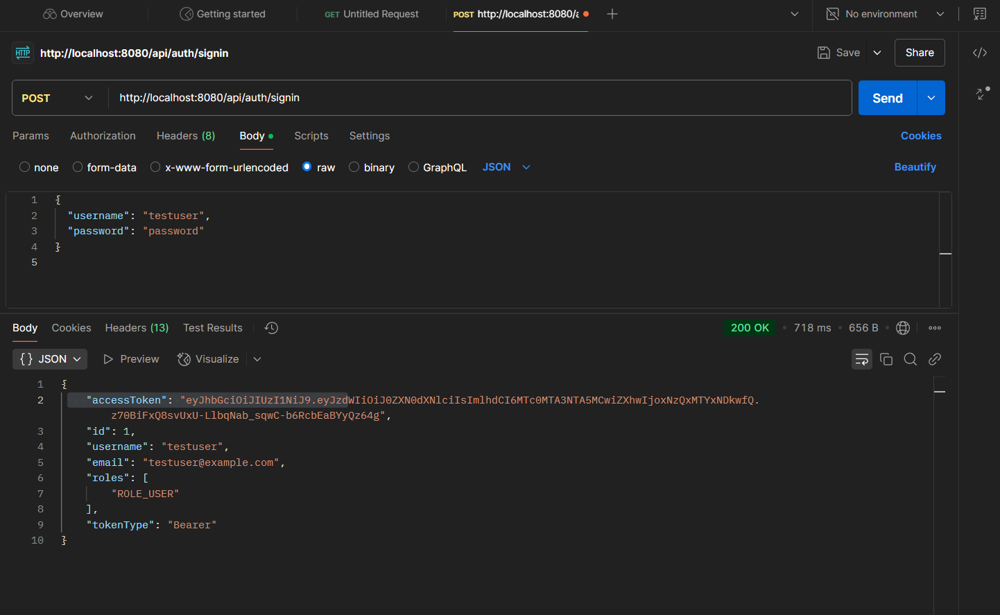
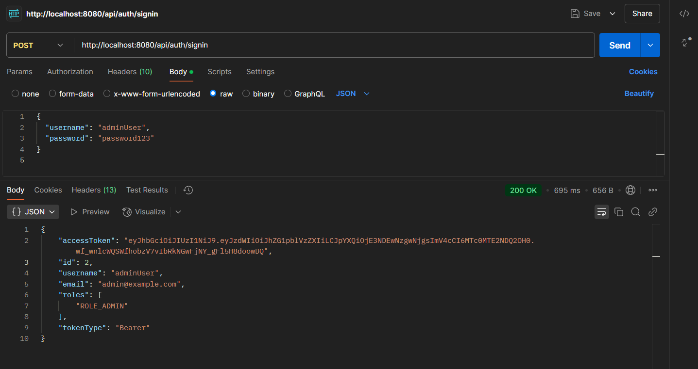
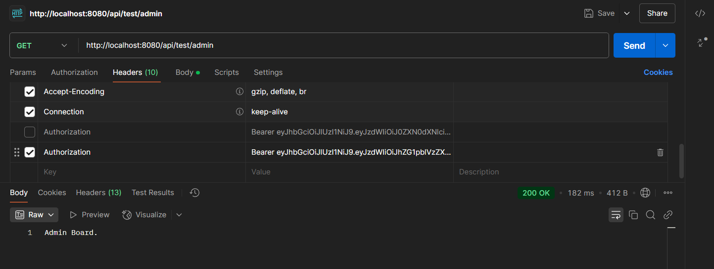

# Spring Boot JWT Authentication

## Giới thiệu
Đây là một project Spring Boot với Spring Security và JSON Web Token (JWT) để thực hiện xác thực và phân quyền người dùng.

## **Yêu cầu môi trường**
Trước khi chạy project, cần đảm bảo các công cụ sau đã được cài đặt:
- **Java 17+**
- **Maven** (kiểm tra bằng `mvn -v`)
- **PostgreSQL hoặc MySQL** (để lưu trữ dữ liệu người dùng)
- **Postman** (để kiểm thử API)
- **IntelliJ IDEA hoặc VS Code** (để chỉnh sửa code nếu cần)

## **Cài đặt và chạy project**
  1. **Chạy ứng dụng**:
   ```sh
   mvn clean spring-boot:run
   ```
   - Ứng dụng sẽ chạy trên `http://localhost:8080/`

---

## **Hướng dẫn sử dụng API với Postman**

Dưới đây là các bước minh chứng API hoạt động đúng:

### **Bước 1: Thêm các roles vào bảng (User, Admin, Moderator)**
- Truy cập vào `http://localhost:8080/h2-console` để cập nhật cơ sở dữ liệu


> Thêm các Roles vào bảng.

---

### **Bước 2: Tạo tài khoản User**
- Chọn phương thức `POST`
- Gửi request đăng ký tài khoản user.


> Hình ảnh minh chứng việc tạo tài khoản user thành công.

---

### **Bước 3: Đăng nhập tài khoản User và nhận JWT Token**
- Chọn phương thức `POST`
- Gửi request đăng nhập user và nhận token JWT.


> Hình ảnh hiển thị JWT token sau khi đăng nhập thành công.

---

### **Bước 4: Truy cập nội dung dành cho User**
- Sử dụng JWT token để gửi request `GET` vào nội dung user.


> Hình ảnh minh chứng truy cập thành công nội dung dành cho user.

---

### **Bước 5: Truy cập nội dung dành cho Admin (bị từ chối)**
- Dùng JWT token của User để gửi request `GET` vào nội dung admin -> bị từ chối quyền truy cập.


> Hình ảnh minh chứng user không có quyền truy cập vào nội dung admin.

---

### **Bước 6: Tạo tài khoản Admin**
- Gửi request `POST` để đăng ký tài khoản admin.


> Hình ảnh minh chứng tạo tài khoản admin thành công.

---

### **Bước 7: Đăng nhập tài khoản Admin và nhận JWT Token**
- Sử dụng thông tin admin để đăng nhập và nhận JWT token.


> Hình ảnh minh chứng admin đăng nhập thành công và nhận JWT token.

---

### **Bước 8: Truy cập nội dung dành cho Admin thành công**
- Dùng JWT token của Admin để gửi request `GET` vào nội dung admin -> truy cập thành công.


> Hình ảnh minh chứng admin có quyền truy cập nội dung admin thành công.

---
Bài làm của: Lê Xuân Bách - MSV 22024506

