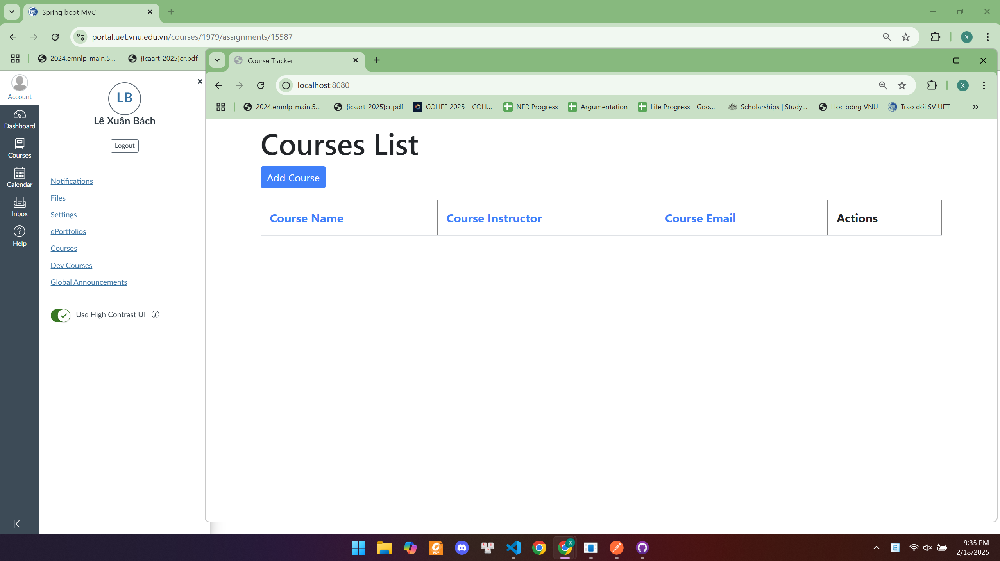
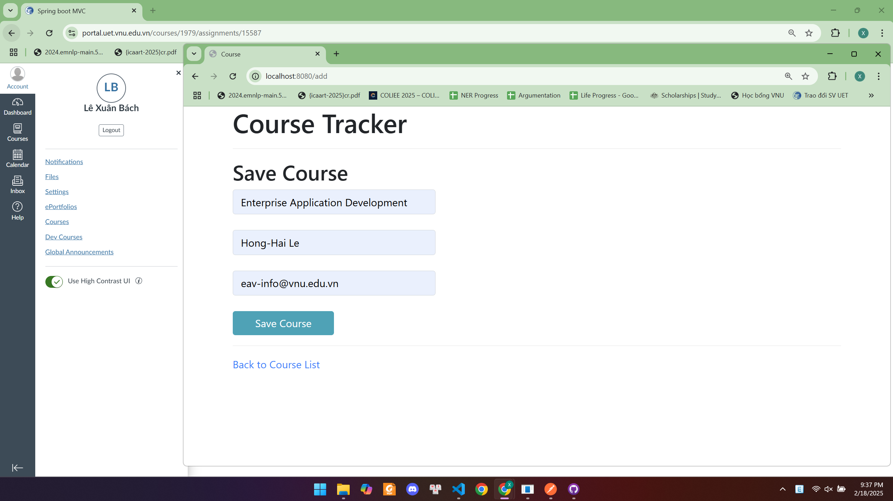
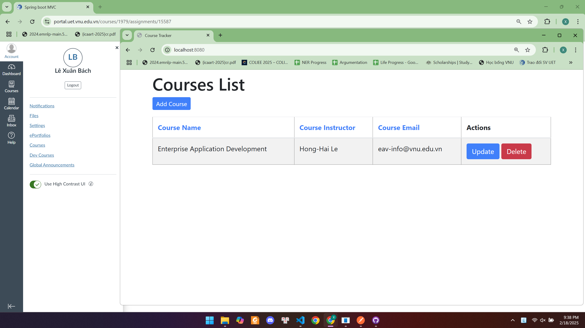
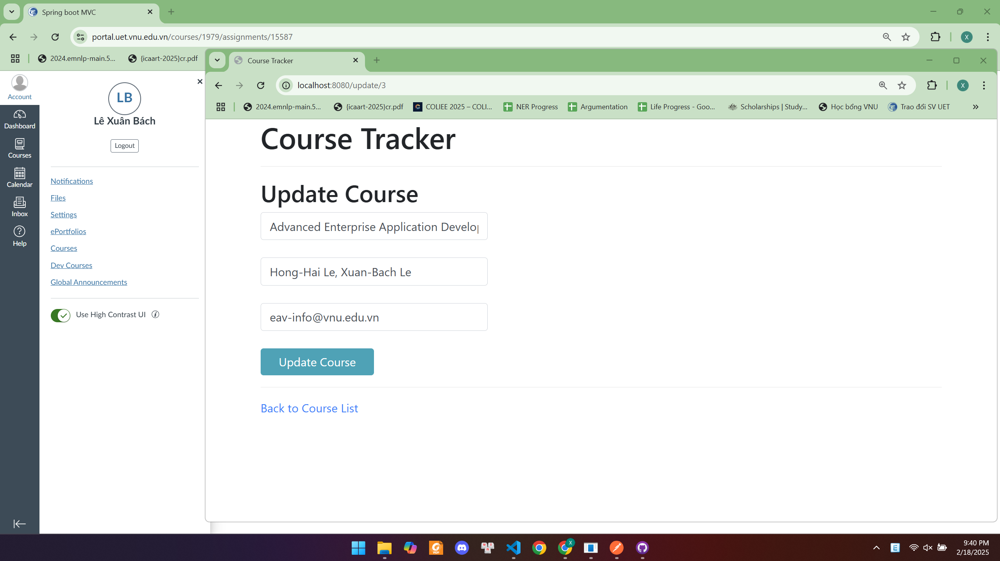
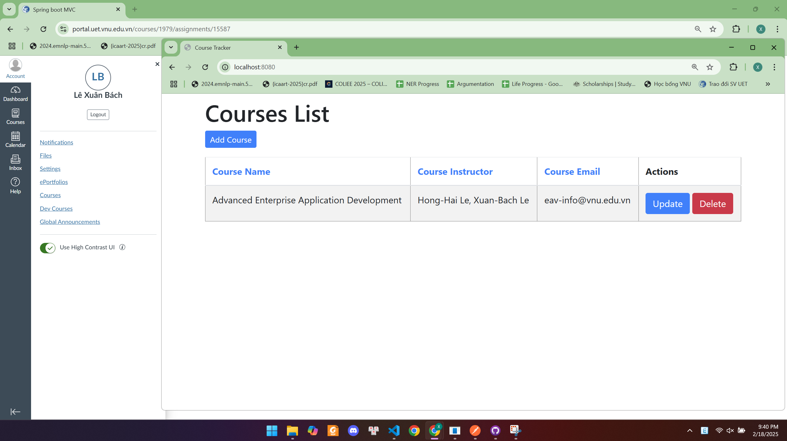

# Spring MVC CRUD

## Hướng dẫn chạy project
Để chạy project Spring MVC CRUD cần thực hiện các bước sau:

### **1. Cài đặt môi trường**
Trước khi chạy project, đảm bảo đã cài đặt các công cụ sau:
- **Java 17+** 
- **Maven** (Để kiểm tra, chạy lệnh `mvn -v` trên terminal)

### **2. Chạy project**
Mở terminal và điều hướng đến thư mục chứa project, sau đó chạy lệnh:
```sh
mvn clean spring-boot:run
```
Lệnh này sẽ:
- Xóa các file biên dịch cũ
- Biên dịch lại toàn bộ project
- Chạy ứng dụng Spring Boot trên **port 8080**

---

## **Hướng dẫn sử dụng ứng dụng**
Ứng dụng này cung cấp các chức năng quản lý danh sách Course. Dưới đây là các bước minh họa để kiểm tra hoạt động của ứng dụng:

### **Bước 1: Xem danh sách Course ban đầu**
- Truy cập URL: `http://localhost:8080/`
- Giao diện hiển thị danh sách Course trống.


> Hình ảnh trên cho thấy danh sách Course ban đầu trống.

---

### **Bước 2: Thêm một Course mới**
- Nhấp vào nút **Add New Course** trên giao diện chính.
- Giao diện chuyển đến trang thêm Course mới.


> Hình ảnh trên là giao diện để thêm thông tin Course mới.

---

### **Bước 3: Lưu Course vừa tạo**
- Nhập thông tin Course vào biểu mẫu, sau đó nhấp vào nút **Save**.
- Giao diện quay về trang chủ và hiển thị danh sách chứa Course vừa tạo.


> Hình ảnh trên cho thấy danh sách Course sau khi thêm thành công một Course mới.

---

### **Bước 4: Cập nhật thông tin Course**
- Trên trang chủ, nhấp vào nút **Edit** bên cạnh Course muốn chỉnh sửa.
- Giao diện chuyển đến trang chỉnh sửa thông tin Course.
- Thay đổi thông tin cần thiết và nhấp vào **Save** để lưu.


> Hình ảnh trên cho thấy giao diện chỉnh sửa thông tin Course.

---

### **Bước 5: Xem danh sách sau khi chỉnh sửa**
- Sau khi chỉnh sửa, giao diện quay về trang chủ và hiển thị danh sách Course đã được cập nhật.


> Hình ảnh trên minh họa danh sách Course sau khi cập nhật thông tin thành công.

---

### **Bước 6: Xóa một Course**
- Nhấp vào nút **Delete** bên cạnh Course cần xóa.
- Giao diện quay về trang chủ và hiển thị danh sách Course sau khi xóa (nếu không còn Course nào, danh sách sẽ trống).


> Hình ảnh trên cho thấy danh sách Course sau khi đã xóa một Course.

---

Bài làm của: Lê Xuân Bách - MSV 22024506