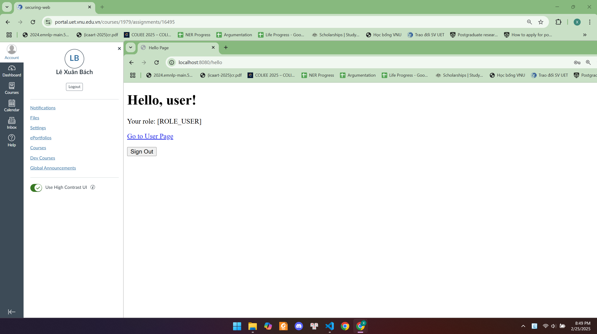
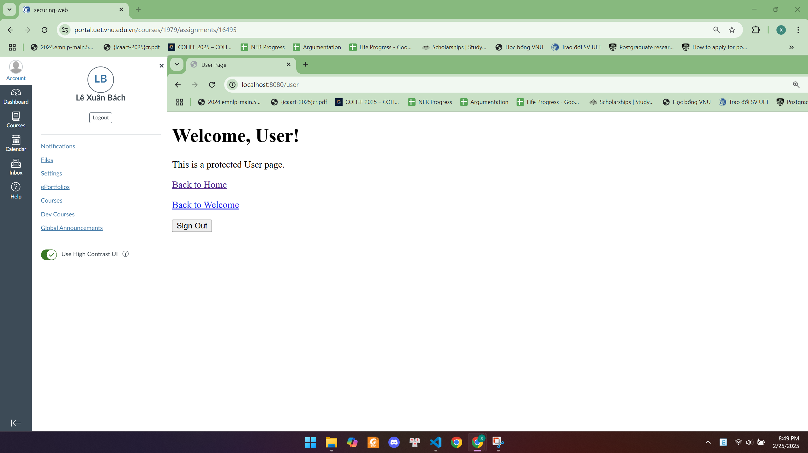
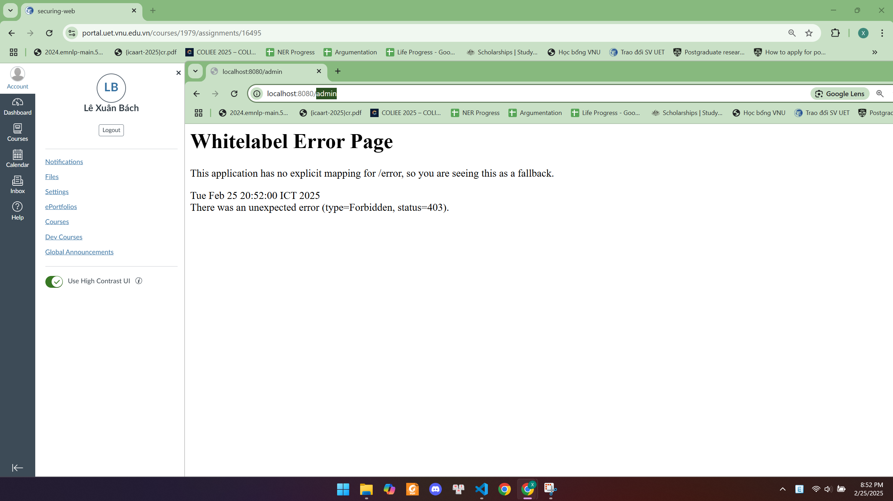
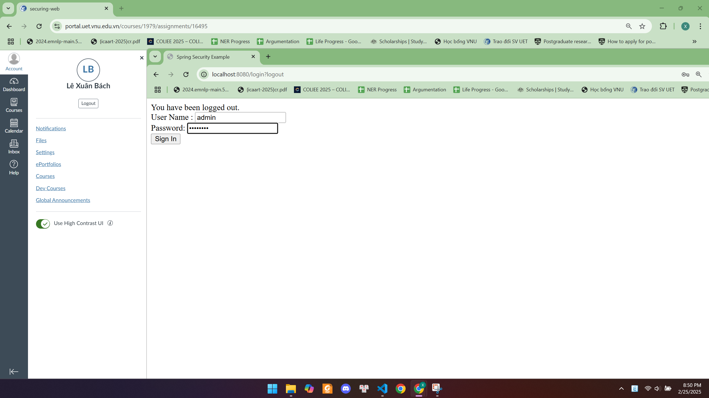

# Securing Web

## Yêu Cầu Môi Trường

Trước khi chạy project, hãy đảm bảo môi trường của bạn đã được cài đặt:
- **Java 17+** 
- **Gradle** 
- **Spring Boot** 

## Hướng Dẫn Chạy Project

1. **Build project**
    ```sh
   ./gradlew build
   ```

2. **Chạy project bằng Gradle Wrapper** (không cần cài đặt Gradle toàn cục):
   ```sh
   ./gradlew bootRun
   ```

3. **Truy cập ứng dụng**
   * Mở trình duyệt và truy cập: `http://localhost:8080`
   * Hệ thống hỗ trợ ba tài khoản mẫu để kiểm tra bảo mật:

        - **User**  
        - Username: `user`  
        - Password: `user123`

        - **Admin**  
        - Username: `admin`  
        - Password: `admin123`

        - **Superadmin**  
        - Username: `superadmin`  
        - Password: `superadmin123`
## Minh Chứng Bảo Mật Đăng Nhập

Dưới đây là hình ảnh minh chứng cho hệ thống phân quyền:

### 1. Đăng nhập với user

- Người dùng nhập thông tin tài khoản user để đăng nhập.

### 2. Trang chủ của user

- Sau khi đăng nhập, user được chuyển đến trang chủ của mình.

### 3. Truy cập user page

- User có thể truy cập vào trang dành cho người dùng.

### 4. Thử truy cập admin page (bị từ chối)

- User cố gắng truy cập vào `/admin` nhưng hệ thống từ chối quyền truy cập.

### 5. Đăng xuất và đăng nhập bằng admin

- User đăng xuất và thực hiện đăng nhập bằng tài khoản admin.

### 6. Truy cập admin page

- Admin có quyền truy cập vào `/admin` và có thể xem nội dung của trang này.

### 7. Đăng xuất và đăng nhập bằng superadmin

- Admin đăng xuất và thực hiện đăng nhập bằng tài khoản superadmin.

### 8. Trang chủ của superadmin

- Trang chủ của superadmin hiển thị cả hai đường dẫn đến user page và admin page.

### 9. Truy cập admin page với superadmin

- Superadmin có quyền truy cập vào `/admin` mà không bị hạn chế.

### 10. Truy cập user page với superadmin

- Superadmin cũng có quyền truy cập vào user page.

---

Bài làm của: Lê Xuân Bách - MSV 22024506
