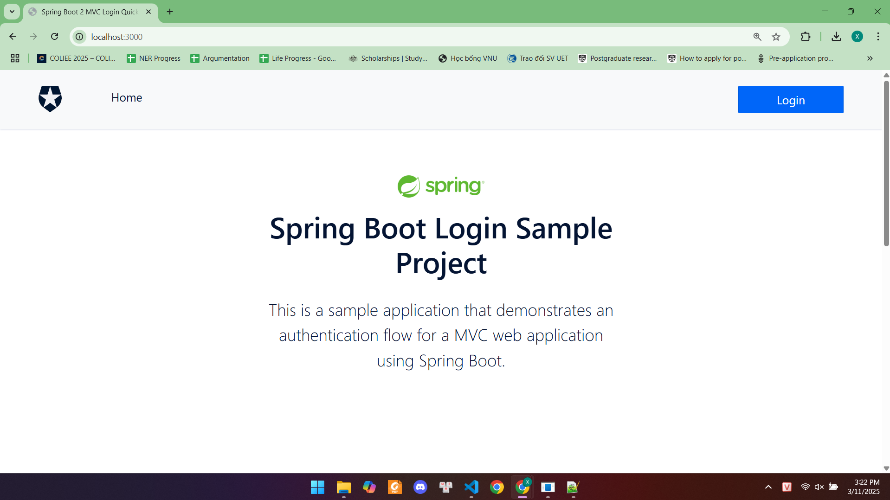
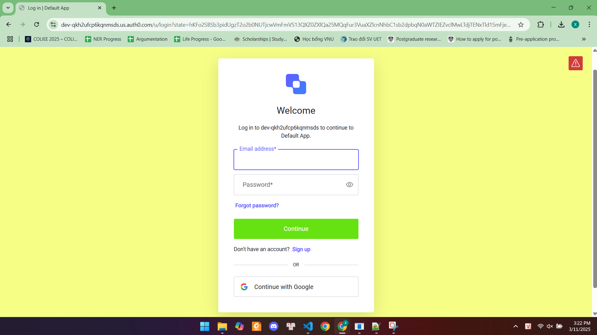
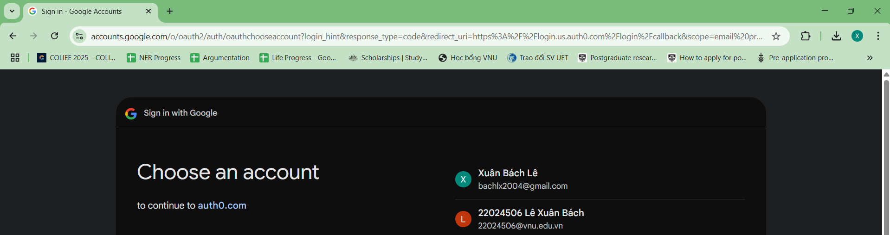
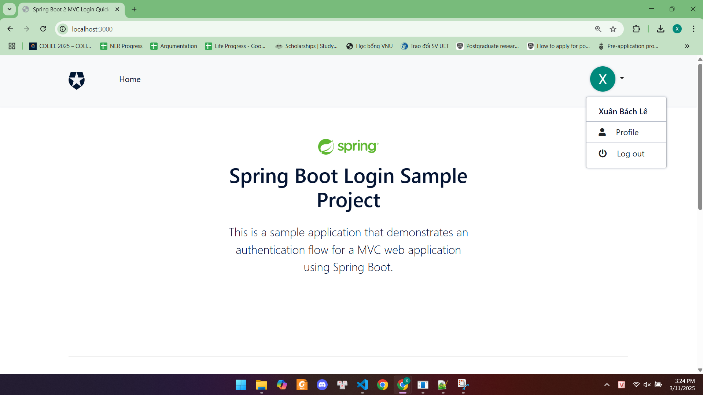

# Spring Boot Đăng nhập - MVC 
 
- Thêm xác thực với Auth0 bằng cách sử dụng [Okta Spring Boot Starter](https://github.com/okta/okta-spring-boot)  vào ứng dụng Spring Boot MVC

- Truy cập thông tin hồ sơ của người dùng đã xác thực

- Chỉ cho phép người dùng đã xác thực truy cập vào một số tài nguyên nhất định


## Yêu cầu 


- Java 17


## Cấu hình 


### Bảng điều khiển Auth0 

 
2. Trên [Bảng điều khiển Auth0](https://manage.auth0.com/#/clients) , tạo một Ứng dụng mới với loại **Regular Web Application** .
 
4. Trong tab **Settings**  của ứng dụng, thêm URL `http://localhost:3000/login/oauth2/code/okta` vào trường **Allowed Callback URLs** .
 
6. Trong tab **Settings**  của ứng dụng, thêm URL `http://localhost:3000/` vào trường **Allowed Logout URLs** .

8. Lưu các thay đổi trong cài đặt ứng dụng. Đừng đóng trang này; bạn sẽ cần một số thông tin để cấu hình ứng dụng ở bước tiếp theo.


### Cấu hình ứng dụng 

Thiết lập các giá trị của ứng dụng trong tệp `src/main/resources/application.yml` với các giá trị từ ứng dụng Auth0 của bạn.


```yaml
client-id: {YOUR-CLIENT-ID}
client-secret: {YOUR-CLIENT-SECRET}
issuer-uri: https://{YOUR-DOMAIN}/
```


### Chạy ứng dụng mẫu 


Mở terminal, di chuyển đến thư mục gốc của dự án và chạy lệnh sau:


Linux hoặc macOS:


```bash
./gradlew bootRun
```


Windows:


```bash
gradlew.bat bootRun
```

Ứng dụng sẽ khả dụng tại địa chỉ [http://localhost:3000](http://localhost:3000/) .

## Minh Chứng SSO

Dưới đây là hình ảnh minh chứng cho hệ thống sử dụng Single Sign-on (SSO):

### 1. Giao diện bên ngoài

- Người dùng chọn vào nút `Login` để đăng nhập.

### 2. Đăng nhập bằng tài khoản Google



### 3. Đăng nhập thành công


---

Bài làm của: Lê Xuân Bách - MSV 22024506
