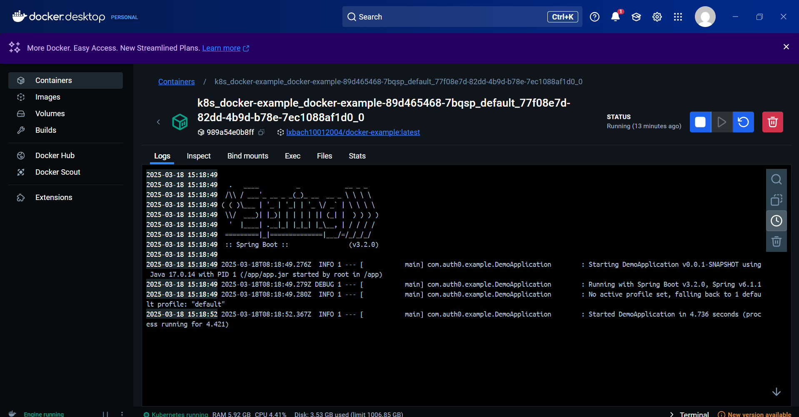
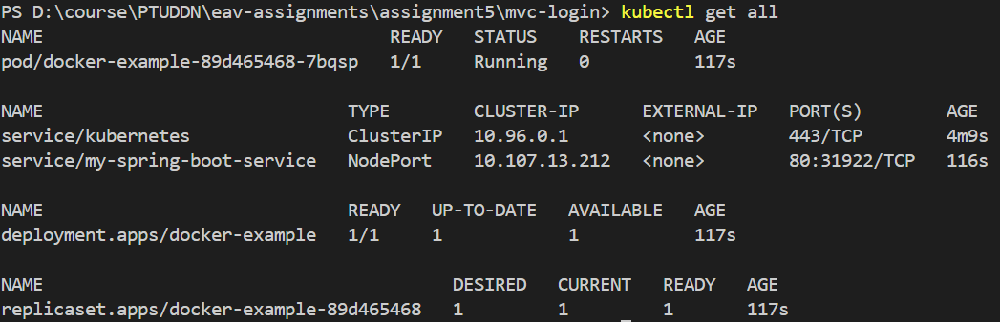

# Spring Boot Đăng nhập - MVC với Docker Desktop và Kubernetes

- Thêm xác thực với Auth0 bằng cách sử dụng [Okta Spring Boot Starter](https://github.com/okta/okta-spring-boot) vào ứng dụng Spring Boot MVC
- Truy cập thông tin hồ sơ của người dùng đã xác thực
- Chỉ cho phép người dùng đã xác thực truy cập vào một số tài nguyên nhất định

## Yêu cầu

- Java 17
- Docker Desktop
- Kubernetes (K8s) trên Docker Desktop

## Cấu hình

### Bảng điều khiển Auth0

2. Trên [Bảng điều khiển Auth0](https://manage.auth0.com/#/clients), tạo một Ứng dụng mới với loại **Regular Web Application**.
4. Trong tab **Settings** của ứng dụng, thêm URL `http://localhost:3000/login/oauth2/code/okta` vào trường **Allowed Callback URLs**.
6. Trong tab **Settings** của ứng dụng, thêm URL `http://localhost:3000/` vào trường **Allowed Logout URLs**.
8. Lưu các thay đổi trong cài đặt ứng dụng. Đừng đóng trang này; bạn sẽ cần một số thông tin để cấu hình ứng dụng ở bước tiếp theo.

### Cấu hình ứng dụng

Thiết lập các giá trị của ứng dụng trong tệp `src/main/resources/application.yml` với các giá trị từ ứng dụng Auth0 của bạn.

```yaml
client-id: {YOUR-CLIENT-ID}
client-secret: {YOUR-CLIENT-SECRET}
issuer-uri: https://{YOUR-DOMAIN}/
```

## Chạy ứng dụng với Docker Desktop và Kubernetes

### 1. Xây dựng image Docker

Mở terminal, di chuyển đến thư mục gốc của dự án và chạy lệnh sau:

```bash
docker build -t docker-example .
```

### 2. Đẩy image lên Docker Hub (tùy chọn)

```bash
docker tag docker-example your-dockerhub-username/docker-example
docker push your-dockerhub-username/docker-example
```

### 3. Chạy container Docker

```bash
docker run -p 3000:3000 docker-example
```

Ứng dụng sẽ khả dụng tại địa chỉ [http://localhost:3000](http://localhost:3000/).

Kết quả



### 4. Triển khai ứng dụng với Kubernetes

Tạo tệp `deployment.yaml` với nội dung sau:

```yaml
apiVersion: apps/v1
kind: Deployment
metadata:
  name: docker-example
spec:
  replicas: 1
  selector:
    matchLabels:
      app: docker-example
  template:
    metadata:
      labels:
        app: docker-example
    spec:
      containers:
      - name: docker-example
        image: your-dockerhub-username/docker-example
        ports:
        - containerPort: 3000
```

Tạo tệp `service.yaml` để cấu hình service:

```yaml
apiVersion: v1
kind: Service
metadata:
  name: my-spring-boot-service
spec:
  type: NodePort
  selector:
    app: docker-example
  ports:
  - protocol: TCP
    port: 80
    targetPort: 3000
```

### 5. Áp dụng cấu hình Kubernetes

```bash
kubectl apply -f deployment.yaml
kubectl apply -f service.yaml
```

### 6. Kiểm tra trạng thái Kubernetes

```bash
kubectl get all
```
Kết quả:




Tìm cổng NodePort và truy cập ứng dụng tại `http://localhost:{NODE_PORT}`.

---

Bài làm của: Lê Xuân Bách - MSV 22024506

