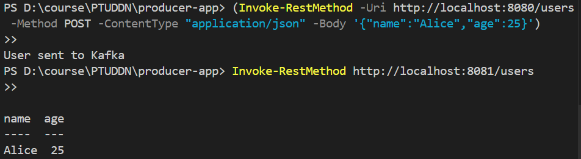

# 🚀 Ứng dụng Spring Boot Producer - Consumer với Kafka & Docker 

Dự án gồm hai ứng dụng Spring Boot: **Producer**  và **Consumer** , sử dụng **Apache Kafka**  để truyền thông điệp giữa hai bên. Kafka và Zookeeper được triển khai thông qua Docker Compose.

## 🧩 Kiến trúc hệ thống 


```lua
+-------------+          Kafka           +-------------+
| Producer    |  --->  Topic (Kafka)  -> | Consumer    |
| Spring Boot |                         | Spring Boot |
+-------------+                         +-------------+
        |                                     |
    localhost:8080                      localhost:8081
```


## 📦 Thành phần chính 

| Thành phần | Mô tả | 
| --- | --- | 
| producer-app | Gửi thông điệp tới Kafka topic (port 8080) | 
| consumer-app | Nhận và xử lý thông điệp từ Kafka topic (port 8081) | 
| docker-kafka-zookeeper | Cung cấp môi trường Kafka & Zookeeper bằng Docker Compose | 


---


## 🔧 Yêu cầu hệ thống 

 
- Java 17
 
- Maven
 
- Docker Desktop
 
- PowerShell (nếu kiểm tra API bằng lệnh)


---


## 🚀 Hướng dẫn triển khai 


### 1. Khởi động Kafka & Zookeeper bằng Docker 


```bash
cd docker-kafka-zookeeper
docker-compose up -d
```


> Kafka sẽ chạy tại `localhost:9092`


---


### 2. Cấu hình ứng dụng 

`producer-app/src/main/resources/application.yml`


```yaml
server:
  port: 8080

spring:
  kafka:
    bootstrap-servers: localhost:9092
    producer:
      key-serializer: org.apache.kafka.common.serialization.StringSerializer
      value-serializer: org.apache.kafka.common.serialization.StringSerializer
```

`consumer-app/src/main/resources/application.yml`


```yaml
server:
  port: 8081

spring:
  kafka:
    bootstrap-servers: localhost:9092
    consumer:
      group-id: my-group
      auto-offset-reset: earliest
      key-deserializer: org.apache.kafka.common.serialization.StringDeserializer
      value-deserializer: org.apache.kafka.common.serialization.StringDeserializer
```


---


### 3. Chạy ứng dụng 

 
- Chạy **Producer** :


```bash
cd producer-app
mvn spring-boot:run
```

 
- Chạy **Consumer** :


```bash
cd consumer-app
mvn spring-boot:run
```


---


### 4. Kiểm tra hoạt động với PowerShell 


#### 4.1. Gửi thông điệp từ Producer 


```powershell
Invoke-RestMethod -Uri http://localhost:8080/users -Method POST -ContentType "application/json" -Body '{"name":"Alice","age":25}'
```


#### 4.2. Lấy thông điệp từ Consumer 


```powershell
Invoke-RestMethod http://localhost:8081/users
```


#### 4.3. Kết quả 


Thông điệp sẽ được gửi từ Producer → Kafka → Consumer. Kết quả xử lý được hiển thị như sau:

 


---

Bài làm của: **Lê Xuân Bách** - MSV 22024506
